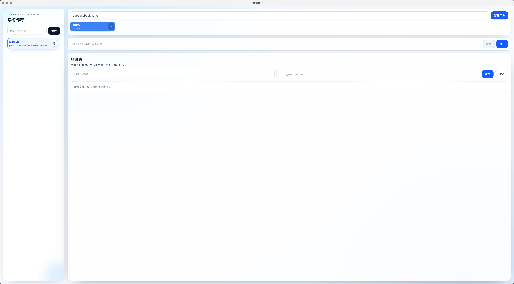
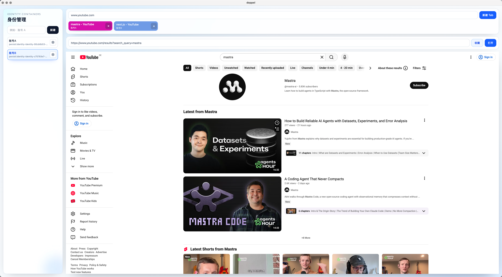
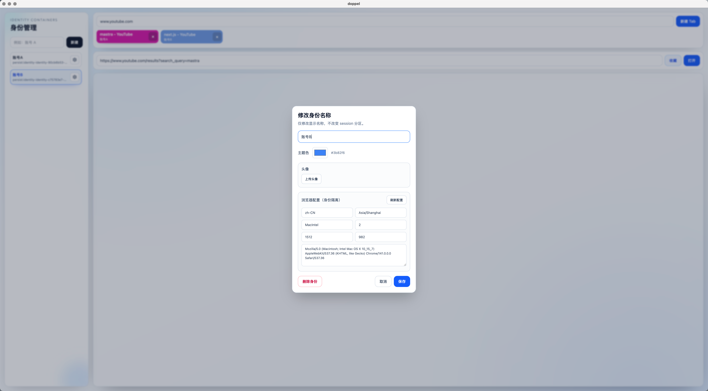

# Doppel

多身份 Electron 浏览器工作台，支持身份隔离、Tab 管理、收藏夹主页和可视化配置。

## 程序预览





## 功能

- 多身份隔离（每个身份独立 `partition`/会话）
- Tab 管理（新建、关闭、切换、拖拽排序，重启后保留顺序）
- 收藏夹主页（`doppel://bookmarks`）
- 收藏夹管理（新增/编辑/删除/拖拽排序）
- 一键收藏当前页面（同一 URL 去重，已收藏状态提示）
- 身份外观配置（头像、颜色）
- 身份浏览器配置（UA/语言/时区/平台/屏幕参数）
- 身份删除（级联删除该身份所有 Tab）

## 快速开始

### 环境要求

- Node.js 18+
- pnpm 9+

### 安装依赖

```bash
pnpm install
```

### 本地开发（Electron + Renderer）

```bash
pnpm dev:electron
```

### 仅前端调试

```bash
pnpm dev:renderer
```

### 构建

```bash
pnpm build
```

### 打包

```bash
pnpm build:electron
```

## 交互说明

- 新建 Tab 输入框默认是 `doppel://bookmarks`
- 收藏夹条目点击后在当前 Tab 打开
- 地址栏“收藏”按钮可把当前页面加入收藏夹
- 编辑身份入口在左侧身份卡片齿轮按钮

## 快捷键

- `Cmd/Ctrl + L` 聚焦新建 Tab 输入框
- `Cmd/Ctrl + T` 新建 Tab
- `Cmd/Ctrl + W` 关闭当前激活 Tab

## 项目结构

```text
electron/        # 主进程与 preload
src/             # React UI
docs/plans/      # 设计文档
```

## 许可证

MIT，见 [LICENSE](./LICENSE)。
